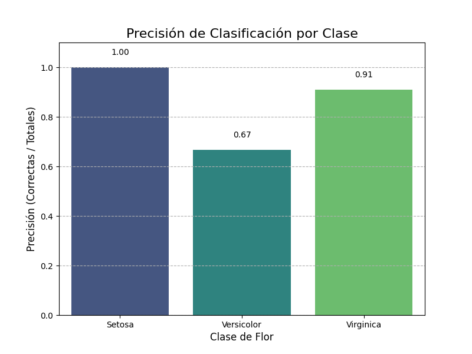
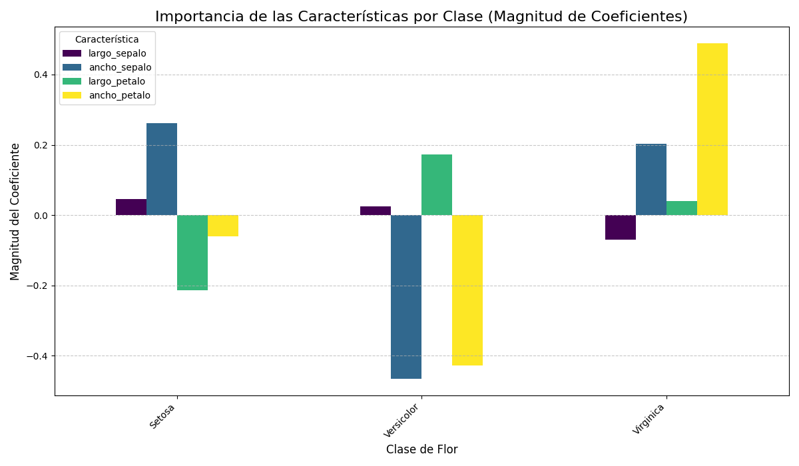
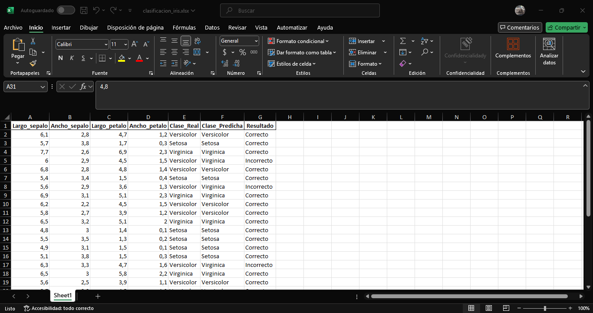

# Clasificación de Flores dataset Iris
Oscar David Barbosa Rodríguez

Introducción a Machine Learning 801

Link de repositorio: https://github.com/ODavidBRodriguez/Clasificacion-dataset-IRIS.git

El conjunto de datos flor Iris es un conjunto de datos multivariante que contiene 50 muestras de cada una de tres especies de Iris (Iris setosa, Iris virginica e Iris versicolor). Cada una de las especies posee cuatro rasgos: el largo y ancho del sépalo y pétalo, en centímetros. 

En este trabajo se utilizará el dataset de flores Iris, se aplicará un modelo de regresión lineal para la clasificación de las clases de flores del dataset, considerando 4 características para 3 posibles clases. Para la implementación del modelo de regresión lineal, se utilizará la técnica de clasificación multiclase **"One-vs-Rest"**.

## Fundamentos del Proyecto

El dataset de Iris contiene 150 muestras de flores, cada una con 4 características (`largo_sepalo`, `ancho_sepalo`, `largo_petalo`, `ancho_petalo`) y una de las tres posibles especies (`Setosa`, `Versicolor`, `Virginica`).

El enfoque "One-vs-Rest" consiste en entrenar tres modelos de regresión lineal separados:
* Un modelo para predecir si una flor es **Setosa** o no lo es.
* Un modelo para predecir si una flor es **Versicolor** o no lo es.
* Un modelo para predecir si una flor es **Virginica** o no lo es.

Para predecir la clase de una nueva flor, se calcula la puntuación obtenida en cada uno de los modelos, y la puntuación más alta calculada en uno de los tres modelos determina la clase predicha final.

## Ecuaciones de los Modelos

Cada modelo de regresión lineal se basa en una ecuación que asigna un peso (coeficiente) a cada característica y un valor de inicio (intercepto). 

Cada clase tiene un modelo con una ecuación calculada, las cuales son:

* Modelo para la clase 'Setosa'

  y = 0.1319 + 0.0459 * largo_sepalo + 0.2624 * ancho_sepalo - 0.2141 * largo_petalo - 0.0595 * ancho_petalo

* Modelo para la clase 'Versicolor'

  y = 1.4837 + 0.0246 * largo_sepalo - 0.4650 * ancho_sepalo + 0.1734 * largo_petalo - 0.4285 * ancho_petalo

* Modelo para la clase 'Virginica'

  y = -0.6156 - 0.0704 * largo_sepalo + 0.2026 * ancho_sepalo + 0.0408 * largo_petalo + 0.4880 * ancho_petalo

## Resultados y Métricas
El modelo fue entrenado con el 80% de los datos y evaluado con el 20% restante. Además, el modelo alcanzó una precisión general del 87%.

La precisión varía según la clase. Este gráfico de barras muestra la tasa de predicciones correctas para cada clase. Se puede apreciar que la clase Setosa posee una precisión impresionantemente alta.

Este gráfico de barras muestra la importancia de cada característica para la clasificación de cada clase, basándose en los coeficientes de la regresión lineal.

## Exportación de Resultados
Todos los resultados de la clasificación se exportan automáticamente a un archivo de Excel (clasificacion_iris.xlsx) en la carpeta resultados/. El script sobrescribe el archivo si ya existe, garantizando que los datos estén siempre actualizados.

El archivo de Excel contiene los resultados de las clasificación para los datos tomados como prueba (30 en total) en el cual se pueden apreciar las características de cada flor de prueba, su clase o tipo de flor real y su clase predicha. Al final hay una columna la cual indica si la predicción fue correcta en base a la clase real y la predicha, esto con el fin de poder visualizar los resultados de las predicciones y la precisión del modelo.

El archivo puede ser visualizado en la carpeta resultados/. La siguiente imágen en una captura de pantalla del archivo excel y algunos de los resultados obtenidos de la predicción.

Se puede apreciar que en algunos casos la predicción fue erronea, y demuestra que los modelos no cuentan con una precisión total en las predicciones, lo que significa que no está sobreajustado el programa aunque si es bastante alto, y logra predecir la mayoría de casos.

## Conclusiones

* La alta precisión general del modelo indica que las clases son en gran medida separables linealmentes. La clase Setosa es casi perfectamente separable, esto se puede ver reflejado en su alta precisión de predicción.

* El análisis de los coeficientes de los modelos proporcionó una visión clara de qué características son más influyentes en la clasificación. Las dimensiones del pétalo (largo_petalo y ancho_petalo) mostraron ser las características más importantes para distinguir entre las tres especies. Por el contrario, las dimensiones del sépalo tuvieron un impacto menor en la toma de decisiones.

* La estrategia One-vs-Rest hace que sea más sencilla la clasificación de una instancia en una categoría específica, ya que cada clase tiene su propio modelo dedicado. Pero también puede presentar desafíos con clases que no son fácilmente separables linealmente, como se observó con Versicolor y Virginica. 

